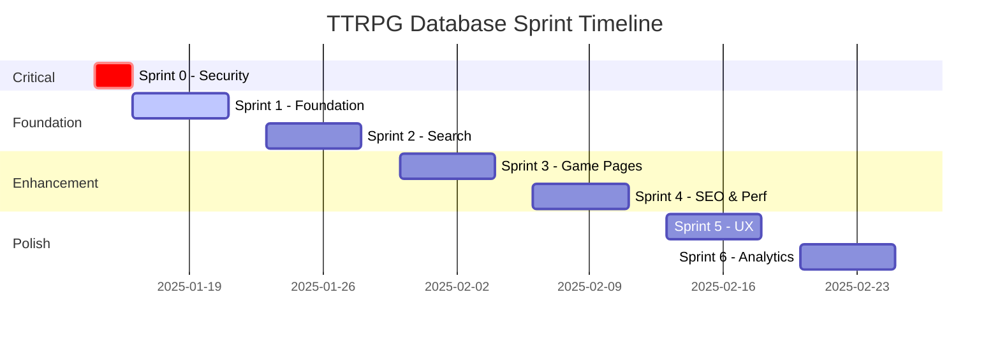

# Sprint Overview - TTRPG Database

## Project Timeline
**Total Duration**: 6 weeks + ongoing  
**Start Date**: January 2025  
**Target Launch**: Public beta by end of February 2025

## Sprint Roadmap

## Sprint Dependencies

### Critical Path
1. **Sprint 0** → Must complete before ANY other work
2. **Sprint 1** → Foundation for all UI work
3. **Sprint 2** → Core functionality needed for launch
4. **Sprint 3** → Content display essential for users
5. **Sprint 4** → SEO critical for discoverability

### Parallel Work Possible
- Sprint 5 & 6 can overlap with Sprint 4
- Admin tools can be developed alongside public features
- Design work can proceed ahead of implementation

## Key Milestones

| Date | Milestone | Description |
|------|-----------|-------------|
| Jan 16 | Security Complete | All public modifications disabled |
| Jan 23 | Admin Dashboard Live | Internal content management ready |
| Jan 30 | Search System Live | Core search functionality complete |
| Feb 6 | Content Ready | Game pages fully functional |
| Feb 13 | SEO Optimized | Ready for search engines |
| Feb 20 | Beta Launch | Public beta announcement |
| Feb 27 | Analytics Live | Full feature set complete |

## Success Metrics

### Sprint 0 (Security)
- ✅ Zero public write access to database
- ✅ Admin authentication implemented
- ✅ All modification UI elements hidden

### Sprint 1 (Foundation)
- ✅ Landing page conversion > 10%
- ✅ Admin can manage all content
- ✅ Page load time < 2 seconds

### Sprint 2 (Search)
- ✅ Search response < 200ms
- ✅ 90% search accuracy
- ✅ Filter combinations working

### Sprint 3 (Game Pages)
- ✅ All game data displayed
- ✅ Images loading properly
- ✅ Affiliate links tracked

### Sprint 4 (SEO)
- ✅ All pages have meta tags
- ✅ Schema.org implemented
- ✅ Sitemap generated

### Sprint 5 (UX)
- ✅ Mobile responsive
- ✅ Accessibility score > 90
- ✅ User actions have feedback

### Sprint 6 (Analytics)
- ✅ Dashboard loads < 1 second
- ✅ Charts interactive
- ✅ Data accurate

## Risk Management

### High Risk Items
1. **Database Performance** - May need indexing optimization
2. **Image Storage** - Costs could escalate
3. **Search Complexity** - Natural language may be challenging
4. **SEO Competition** - Established sites have advantage

### Mitigation Strategies
- Start with simple search, enhance gradually
- Use image CDN with caching
- Monitor database performance early
- Focus on long-tail SEO keywords

## Resource Requirements

### Technical
- Supabase (database + auth)
- Cloudinary or similar (images)
- Vercel/Netlify (hosting)
- Domain + SSL

### Human
- 1 Developer (full-time)
- UI/UX consultation (as needed)
- Content curator (for game data)
- SEO consultant (Sprint 4)

## Post-Launch Roadmap

### Phase 7 (Month 2-3)
- User accounts (still read-only)
- Advanced personalization
- API development

### Phase 8 (Month 3-4)
- Mobile app planning
- Partnership discussions
- Monetization testing

### Phase 9 (Month 4-6)
- Community features (with moderation)
- User-generated content (carefully controlled)
- International expansion

## Notes
- **Priority Zero**: Security and preventing unauthorized content
- All user-generated content features are **intentionally delayed**
- Focus on quality data curation over quantity initially
- Build trust before opening community features
